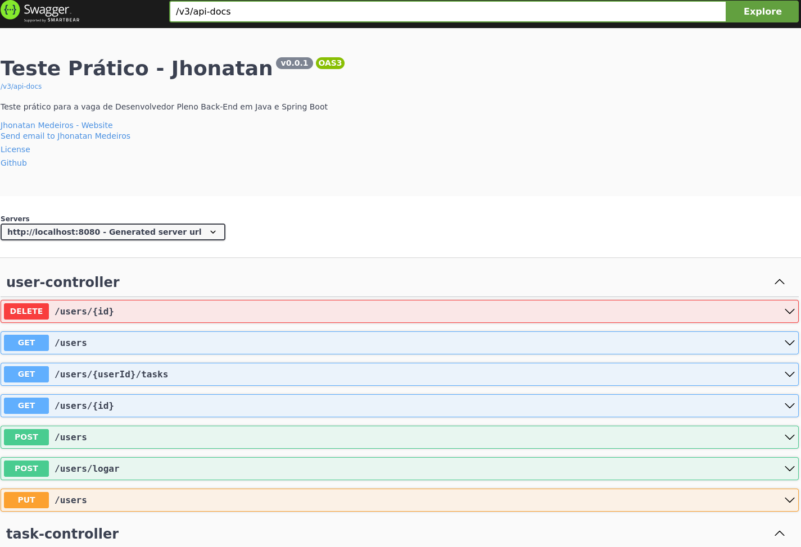

Projeto Spring Boot com Swagger - API Documentada

Este projeto é uma aplicação Spring Boot configurada para expor uma API documentada com Swagger utilizando Springdoc OpenAPI.
Requisitos

Certifique-se de ter os seguintes requisitos instalados para rodar o projeto:

```bash
    Java 11 ou superior
    Maven 3.6+
```

Configurações
1. Clonar o repositório

Clone o repositório Git para sua máquina local:

```bash
git clone https://github.com/JhonMeddev/tasks
```

2. Construir o projeto

Utilize o Maven para baixar as dependências e construir o projeto:

```bash

mvn clean install

```

3. Executar a aplicação

Agora você pode executar o projeto diretamente com o Maven:

```bash

mvn spring-boot:run

```

4. Acessar a API

A aplicação estará disponível no endereço: 
```bash

 http://localhost:8080

```

5. Acessar a documentação Swagger

Com a aplicação em execução, você pode acessar a documentação da API via Swagger UI:
login: root
senha: root

```bash

    Swagger UI: http://localhost:8080/swagger-ui.html
    Documentação OpenAPI JSON: http://localhost:8080/v3/api-docs
```




7. Executar Testes (Opcional)

Para rodar os testes unitários e de integração, execute o seguinte comando Maven:

```bash

mvn test

```

Dependências principais

Este projeto inclui as seguintes dependências principais:

```bash
    Spring Boot 2.6.1
    Springdoc OpenAPI 1.6.15 para integração com Swagger
    Hibernate para ORM (Object-Relational Mapping)
    H2 para banco de dados em memória (para desenvolvimento)
```


Dúvidas?

Se encontrar algum problema ou tiver dúvidas, fique à vontade para abrir uma issue no repositório.
